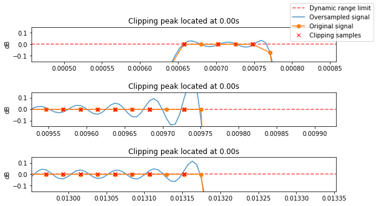

True-peak detection
===================

True-peak metering takes into account the idea of inter-sample peaks.
This means that the actual peak of the waveform is in between two
adjacent samples, but it will not be possible to measure it until the
signal is converted back to analog. In the worst case, an inter-sample
peak may lay outside the digital dynamic range [-1, 1], potentially
generating clipping in further stages that cannot be noticed in the
digital domain.

Although some sophisticated Digital to Analog Converters (DAC) can deal
with inter-sample clipping, it is always better to detect it before
reaching the DAC to make sure that this will not be a problem despite
the conversion hardware.

There are several strategies to predict the inter-sample peaks. In this
notebook, we focus on the approach based on oversampling the input
signal.

The ITU-R BS.1770 recommendation
--------------------------------

The ITU-R BS.1770 recommendation proposes the following signal chain
based on the oversampling strategy:

::

   -12.04dB --> x4 oversample --> LowPass --> abs() --> 20 * log10() --> +12.04dB

`TruePeakDetector <https://essentia.upf.edu/reference/std_TruePeakDetector.html>`__
implements the true-peak level meter specified in the second annex of
the ITU-R BS.1770-2[1] or the ITU-R BS.1770-4[2] (default). In this
implementation, the gain stages are suppressed as they are not required
when working with float point values. Also the result is returned in
natural units. Additionally, the algorithm returns the position of the
samples outside the [-1, 1] range after resampling, as potential analog
clipping candidates.

Here we show an example of true-peak metering:

.. code:: ipython3

    from essentia.standard import MonoLoader, TruePeakDetector
    import numpy as np
    import matplotlib.pyplot as plt
    
    plt.rcParams["figure.figsize"] = (9, 5)
    
    EPS = np.finfo(np.float32).eps

.. code:: ipython3

    sr = 44100
    
    audio_file = "../../../test/audio/recorded/distorted.wav"
    audio = MonoLoader(filename=audio_file)()
    
    times = np.arange(len(audio)) / sr
    oversampled_times = np.arange(len(audio) * 4) / (sr * 4)
    
    peak_locations, output = TruePeakDetector(version=2)(audio)
    
    n = 3  # Show three examples.
    f, axes = plt.subplots(n)
    f.subplots_adjust(hspace=0.9)
    for idx in range(n):
        p_idx = idx * 100
        l0 = axes[idx].axhline(0, color="r", alpha=0.7, ls="--")
        l1 = axes[idx].plot(oversampled_times, 20 * np.log10(output + EPS), alpha=0.8)
        l2 = axes[idx].plot(times, 20 * np.log10(np.abs(audio + EPS)), marker="o")
        l3 = axes[idx].plot(peak_locations / sr, np.zeros(len(peak_locations)), color="r", marker="x", linestyle="None")
    
        axes[idx].set_xlim([peak_locations[p_idx] / sr - 0.0002, peak_locations[p_idx] / sr + 0.0002])
        axes[idx].set_ylim([-0.15, 0.15])
        axes[idx].set_title("Clipping peak located at {:.2f}s".format(peak_locations[p_idx] / (sr * 4)))
        axes[idx].set_ylabel("dB")
    
    f.legend([l0, l1[-1], l2[-1], l3[-1]], ["Dynamic range limit (dB)", "Oversampled signal", "Original signal", "Clipped samples"])
    plt.show()

The resampled signal is closer to the analog signal once it goes through
the DAC. The part of this signal peaking above 1 may produce additional
distortion if the analog amplifier doesn’t have enough headroom to
handle this additional amplitude. As this type of distortion depends
entirely on the design of the playback hardware, it is always
recommended to produce music so the true peak positions never overcome
the dynamic range [-1, 1].

References
----------

[1] Series, B. S. (2011). Recommendation ITU-R BS.1770-2. Algorithms to
measure audio programme loudness and true-peak audio level,
https://www.itu.int/dms_pubrec/itu-r/rec/bs/R-REC-BS.1770-2-201103-S!!PDF-E.pdf

[2] Series, B. S. (2011). Recommendation ITU-R BS.1770-4. Algorithms to
measure audio programme loudness and true-peak audio level,
https://www.itu.int/dms_pubrec/itu-r/rec/bs/R-REC-BS.1770-4-201510-I!!PDF-E.pdf
