NSGConstantQ Examples
=====================

This notebook provides practical examples of using the
`NSGConstantQ <https://essentia.upf.edu/reference/std_NSGConstantQ.html>`__
algorithm.

.. code:: ipython2

    import numpy as np
    import matplotlib.pyplot as plt
    from essentia import Pool
    from essentia import run
    import essentia.streaming as streaming
    import essentia.standard as standard
    
    %matplotlib inline
    plt.rcParams['figure.figsize'] = (8.0, 6.0)
    eps = np.finfo(np.float64).eps

Configuring the algorithm
-------------------------

In this example the algorithm is configured to analyse a fragment of
male singing voice. The frequency range we want to analyze is set
accordingly. The minimum frequency is set to match the freqeuncy of a
note (C2 in this case). The ``binsPerOctave`` is set to a miltiple of 12
so that the frequency channels (bands) we want to compute match
subdivisions of an equal tempered scale (in our case, 4 bins per
semitone).

``rasterize`` controls the interpolation on the frequency channels. When
set to ‘full’, frequency channels will have the same lengths. The ‘full’
interpolation is mandatory if one wants to stream frames in the
streaming mode.

If one wants to perform transformations in the constant-Q domain and
then go back to the time domain, both direct and inverse algorithms
(NSGConstantQ and NSGIConstantQ) should be configured with exactly the
same parameters. The easiest way to do this is to use a dictionary for
configuring both algorithms’ parameters.

.. code:: ipython2

    kwargs = {
    'inputSize': 4096,
    'minFrequency': 65.41,
    'maxFrequency': 6000,
    'binsPerOctave': 48,
    'sampleRate': 44100,
    'rasterize': 'full',
    'phaseMode': 'global',
    'gamma': 0,
    'normalize': 'none',
    'window': 'hannnsgcq',
    }

Standard mode
-------------

Standard mode is very simple to use. In this example we transform a
singing voice into the Gabor domain and then compute back its time
representation. It is important to configure both algorithms with the
same parameters. It is especially important to set ``inputSize`` so that
the inverse algorithm is able to reconstruct the input signal.

.. code:: ipython2

    x = standard.MonoLoader(filename = '../../../test/audio/recorded/vignesh.wav')()[:-1] 
    # Remove the last sample to make the signal even
    
    kwargs['inputSize'] = len(x)
    
    CQStand = standard.NSGConstantQ(**kwargs)
    CQIStand = standard.NSGIConstantQ(**kwargs)
    
    constantq, dcchannel, nfchannel = CQStand(x)
    y = CQIStand(constantq, dcchannel, nfchannel)

NSGConstantQ outputs three vectors. The first one (``constantq``) is the
actual transform and it is a complex time-frequency representation of
the input audio. Depending on the ``rasterize`` parameter it will behave
differently:

-  ‘none’: each frequency channel will have the minimum length needed
   give full frequency support to its bandwidth. The ``constantq``
   output is a list of lists.
-  ‘piecewise’: adds some interpolation to make the length of each
   channel a power of 2 in order to perform optimized FFTs.
-  ‘full’: interpolates the channels so that they all have the same
   length and the ``constantq`` output is a square matrix (i.e., a 2D
   complex numpy matrix). This may be the easiest way to manipulate the
   data afterwards.

The other two outputs (``dcchannel`` and ``mfchannel``) are only
important in order to compute the inverse transform.

Constant-Q spectrogram
~~~~~~~~~~~~~~~~~~~~~~

Finally, let’s see how our transform looks like. As the ``constantq``
variable is a complex 2D matrix, we compute its absolute values and then
apply log-transform to obtain the log-spectrogram.

.. code:: ipython2

    # Time labeling
    ticksTime = np.linspace(0, len(constantq.T), 6)
    secs = np.around(ticksTime * kwargs['inputSize'] /  (kwargs['sampleRate'] * len(constantq.T) ) , decimals=1)
    # Octave labeling
    ticksFreq = np.arange(0,len(constantq),kwargs['binsPerOctave'])
    notes =  ['C%i' %f for f in range(2, len(ticksFreq) +2, 1) ]
    
    plt.matshow(np.log(np.abs(constantq)),origin='lower')
    plt.yticks(ticksFreq, notes)
    plt.xticks(ticksTime, secs)
    plt.ylabel('Octave')
    plt.xlabel('Time (s)')
    plt.title('Signal in the time/frequency Gabor domain')
    plt.show()

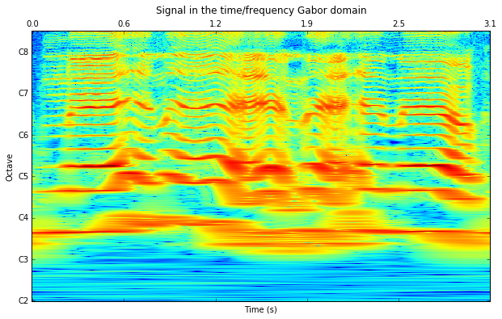

Reconstructed signal
~~~~~~~~~~~~~~~~~~~~

.. code:: ipython2

    plt.plot(y)
    plt.title('Re-Synthetised signal')
    plt.show()
    
    SNR = np.mean(20*np.log10(np.abs(x[100:-100])/np.abs(x[100:-100]-y[100:-100] + eps) + eps))
    print 'Synthesis SNR: %.3f dB' %SNR

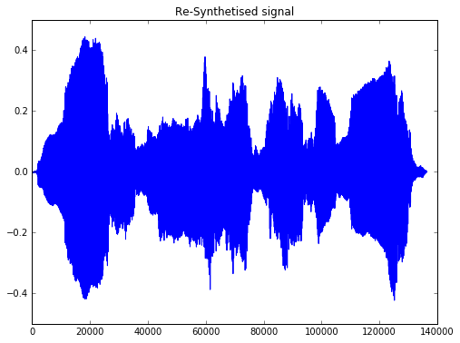

.. parsed-literal::

    Synthesis SNR: 137.906 dB

Last time this script was executed, the maximun difference between the
original and the sinthetized signal was 1.7883e-07. Provided that
Essentia analysis is performed using 32-byte floats (eps = 1.192-07),
this lets the systhesis error in the range of the numerical error. Thus,
it can be considered a theoretically perfect reconstruction.

Streaming mode
--------------

Now let’s reimplement the same example in the streaming mode. Here we
will also perform a frame-wise analysis, suitable for a real-time
implementation.

First, let’s instantiate the algorithms needed for the frame-wise
analysis. We are using ``CartesianToPolar`` to save magnitude and phase
values to a Pool (as it is currently not possible to save complex arrays
to Essentia’s pools).

The length of the frames chosen for the analysis is 8192 with a hop size
of 4096 using triangular windows. This framework makes it possible to
obtain a perfect reconstruction but it is not the only one. Some other
windows and sizes combinations are showed at the end of this notebook.

.. code:: ipython2

    kwargs['inputSize'] = 4096 * 2
    
    CQAlgo = streaming.NSGConstantQStreaming(**kwargs)
    ICQAlgo = streaming.NSGIConstantQ(**kwargs)
    loader = streaming.MonoLoader(filename='../../../test/audio/recorded/vignesh.wav')
    w = streaming.Windowing(type='triangular',normalized=False, zeroPhase=False)
    frameCutter = streaming.FrameCutter(frameSize=kwargs['inputSize'], hopSize=kwargs['inputSize']/2)
    
    CQc2p = streaming.CartesianToPolar()
    DCc2p = streaming.CartesianToPolar()
    NFc2p = streaming.CartesianToPolar()
    
    pool = Pool()

Let’s run the network and save the data to the pool. The actual
transform is sent through the ``constantq`` source. It is the only
output needed for the analysis purposes. However, if the goal is to
modify it and go back to the time domain, two extra outputs, containing
the DC and the Nyquist channels, are required. These outputs contain the
information below and above the analysis range and are required for the
reconstruction of the signal. Additionally, a vector called
‘framestamps’ is returned in order to facilitate the reconstruction of
the data.

-  ´constantq´ shape is ( timestamps , number of channels )
-  ´constantqdc´ shape is ( framestamps , length of th DC channel )
-  ´constantqnf´ shape is ( framestamps , length of th Nyquist channel )
-  ´framestamps´ shape is ( framestamps )

Framewise vectors are returned once per call. Timewise vectores are
returned more than one token per call and their number depends on the
configuration parameters. Using these matrices may be confusing, as the
original algorithm (on which our implementation is based) was not
intended for real-time processing.

.. code:: ipython2

    # Conecting the algorithms
    loader.audio >> frameCutter.signal
    
    frameCutter.frame >> w.frame >> CQAlgo.frame
    
    CQAlgo.constantq >> CQc2p.complex
    CQAlgo.constantqdc >> DCc2p.complex
    CQAlgo.constantqnf >> NFc2p.complex
    CQAlgo.framestamps >> (pool, 'frameStamps')
    
    CQc2p.magnitude >> (pool, 'CQmag')
    CQc2p.phase >> (pool, 'CQphas')
    
    DCc2p.magnitude >> (pool, 'DCmag')
    DCc2p.phase >> (pool, 'DCphas')
    
    NFc2p.magnitude >> (pool, 'NFmag')
    NFc2p.phase >> (pool, 'NFphas')
    
    run(loader)

Plotting the transform
~~~~~~~~~~~~~~~~~~~~~~

.. code:: ipython2

    # Time labeling
    ticksTime = np.linspace(0, len(pool['CQmag']), 6)
    secs = np.around(ticksTime * kwargs['inputSize'] / (2 * kwargs['sampleRate'] * pool['frameStamps'][1] ), decimals=1)
    
    # Octave labeling
    ticksFreq = np.arange(0,len(pool['CQmag'].T),kwargs['binsPerOctave'])
    notes =  ['C%i' %f for f in range(2, len(ticksFreq) +2, 1) ]
    
    
    f, ax = plt.subplots(1, figsize = (13,10))
    ax.matshow(np.log(pool['CQmag'].T),origin='lower', aspect=2)
    plt.yticks(ticksFreq, notes)
    plt.xticks(ticksTime, secs)
    plt.ylabel('Octave')
    plt.xlabel('Time (s)')
    plt.title('Singing Voice')
    plt.show()

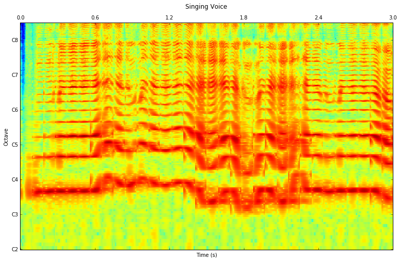

.. code:: ipython2

    # Using the same arguments for inverse transformation as for the analysis
    ICQAlgo = standard.NSGIConstantQ(**kwargs)
    
    # Loop to store the frames. DC and Nyquist channels are just tranformed into cartesian coordinates again. 
    recFrame = [] 
    for i in range(len(pool['DCmag'])-1):
        invDC = standard.PolarToCartesian()(pool['DCmag'][i], pool['DCphas'][i])
        invNF = standard.PolarToCartesian()(pool['NFmag'][i], pool['NFphas'][i])
        
        # Concatenate CQ frames. Here it is done using the 'frameStamp' vector.  
        invCQ = []
        for j in range(pool['frameStamps'][i], pool['frameStamps'][i+1],1):
            invCQ.append(standard.PolarToCartesian()(pool['CQmag'][j], pool['CQphas'][j]))
        
        # A trick to transpose a list of lists.  
        invCQlist = [list(x) for x in zip(*invCQ)]
        
        # The actual inverse transform. 
        recFrame.append(ICQAlgo(invCQlist, invDC, invNF))
    
    
    # Overlaped addition of the input 
    frameSize = kwargs['inputSize']
        
    y = recFrame[0]
    
    invWindow = standard.Windowing(type='triangular',normalized=False, zeroPhase=False)(standard.essentia.array(np.ones(frameSize)))
    
    
    for i in range(1,len(recFrame)):
        y = np.hstack([y,np.zeros(frameSize/2)])
        y[-frameSize:] = y[-frameSize:] + recFrame[i] 
        
    y = y[frameSize/2:]

Reconstruction from Pool in standard mode
~~~~~~~~~~~~~~~~~~~~~~~~~~~~~~~~~~~~~~~~~

This is ugliest cell of this notebook! It shows how to return to the
time domain from the constant-Q transform data stored in the pool using
the standard mode again.

We can compare the original and the synthetised signals and compute the
SNR of the algorithm

.. code:: ipython2

    x = standard.MonoLoader(filename = '../../../test/audio/recorded/vignesh.wav')()
    xtest = x[:len(y)]
    
    SNR = np.mean(20*np.log10(np.abs(xtest)/np.abs(xtest-y + eps) + eps))
    print 'SNR: %.3f dB' %SNR
    
    _, ax = plt.subplots(2, sharex=True)
    ax[0].plot(xtest)
    ax[0].set_title('Original')
    ax[1].plot(y)
    ax[1].set_title('Reconstructed')
    plt.show()

.. parsed-literal::

    SNR: 137.799 dB

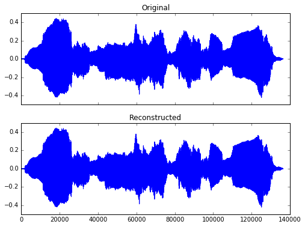

The effect of frame size and window type on constant-q spectrogram in the streaming mode
~~~~~~~~~~~~~~~~~~~~~~~~~~~~~~~~~~~~~~~~~~~~~~~~~~~~~~~~~~~~~~~~~~~~~~~~~~~~~~~~~~~~~~~~

.. code:: ipython2

    def compute_cq(kwargs):
        w = streaming.Windowing(type=kwargs['frameWindow'], normalized=False, zeroPhase=False)
        del kwargs['frameWindow']
        
        CQAlgo = streaming.NSGConstantQStreaming(**kwargs)
        loader = streaming.MonoLoader(filename='../../../test/audio/recorded/vignesh.wav')
        frameCutter = streaming.FrameCutter(frameSize=kwargs['inputSize'], hopSize=kwargs['inputSize']/2)
    
        CQc2p = streaming.CartesianToPolar()
        DCc2p = streaming.CartesianToPolar()
        NFc2p = streaming.CartesianToPolar()
    
        pool = Pool()
    
        # Conecting the algorithms
        loader.audio >> frameCutter.signal
        frameCutter.frame >> w.frame >> CQAlgo.frame
        
        CQAlgo.constantq >> CQc2p.complex
        CQAlgo.constantqdc >> DCc2p.complex
        CQAlgo.constantqnf >> NFc2p.complex
        CQAlgo.framestamps >> (pool, 'frameStamps')
    
        CQc2p.magnitude >> (pool, 'CQmag')
        CQc2p.phase >> (pool, 'CQphas')
    
        DCc2p.magnitude >> (pool, 'DCmag')
        DCc2p.phase >> (pool, 'DCphas')
    
        NFc2p.magnitude >> (pool, 'NFmag')
        NFc2p.phase >> (pool, 'NFphas')
    
        run(loader)
    
        # Plot results
        # Time labeling
        ticksTime = np.linspace(0, len(pool['CQmag']), 6)
        secs = np.around(ticksTime * kwargs['inputSize'] / (2 * kwargs['sampleRate'] * pool['frameStamps'][1] ), decimals=1)
    
        # Octave labeling
        ticksFreq = np.arange(0,len(pool['CQmag'].T),kwargs['binsPerOctave'])
        notes =  ['C%i' %f for f in range(2, len(ticksFreq) +2, 1) ]
    
        f, ax = plt.subplots(1, figsize = (13,10))
        ax.matshow(np.log(pool['CQmag'].T),origin='lower', aspect=2)
        plt.yticks(ticksFreq, notes)
        plt.xticks(ticksTime, secs)
        plt.ylabel('Octave')
        plt.xlabel('Time (s)')
        plt.title('Singing Voice')
        plt.show()
    
        
    framesize = [2048, 2048*2, 2048*4, 2048*8, 2048*16]
    frame_window = ["triangular", "hamming", "hann", "blackmanharris62"] 
    
    for fw in frame_window:
        for fs in framesize:
            print "Frame window:", fw
            print "Frame size:", fs
            kwargs['inputSize'] = fs
            kwargs['frameWindow'] = fw
            compute_cq(kwargs)

.. parsed-literal::

    Frame window: triangular
    Frame size: 2048

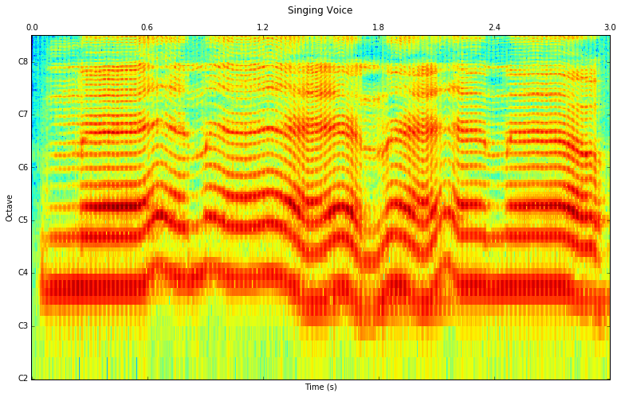

.. parsed-literal::

    Frame window: triangular
    Frame size: 4096

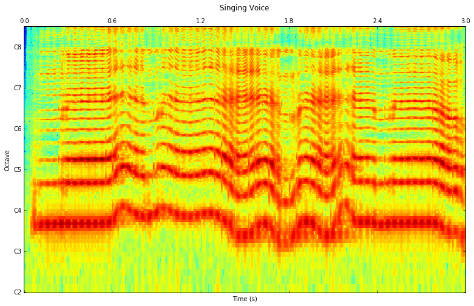

.. parsed-literal::

    Frame window: triangular
    Frame size: 8192

.. parsed-literal::

    Frame window: triangular
    Frame size: 16384

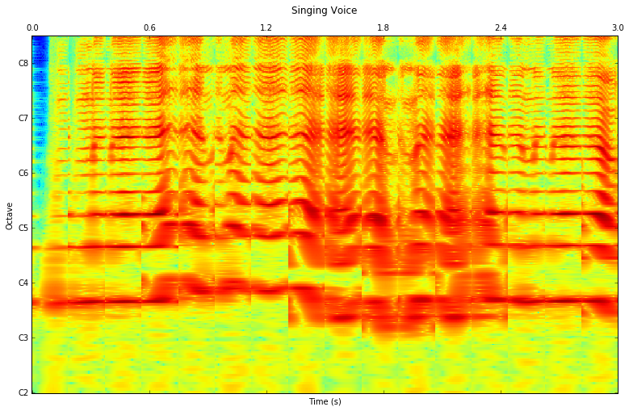

.. parsed-literal::

    Frame window: triangular
    Frame size: 32768

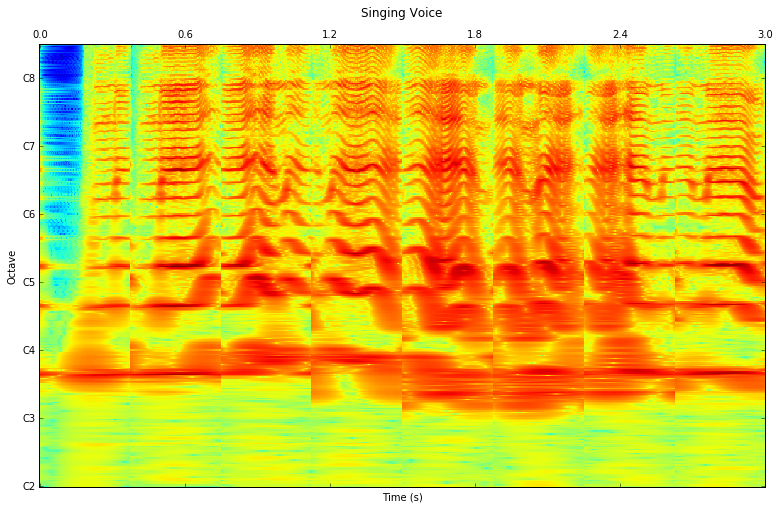

.. parsed-literal::

    Frame window: hamming
    Frame size: 2048

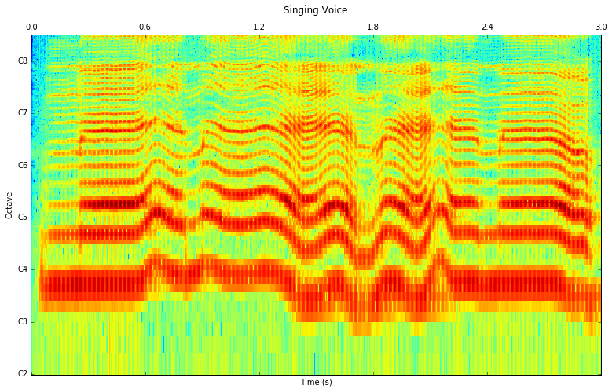

.. parsed-literal::

    Frame window: hamming
    Frame size: 4096

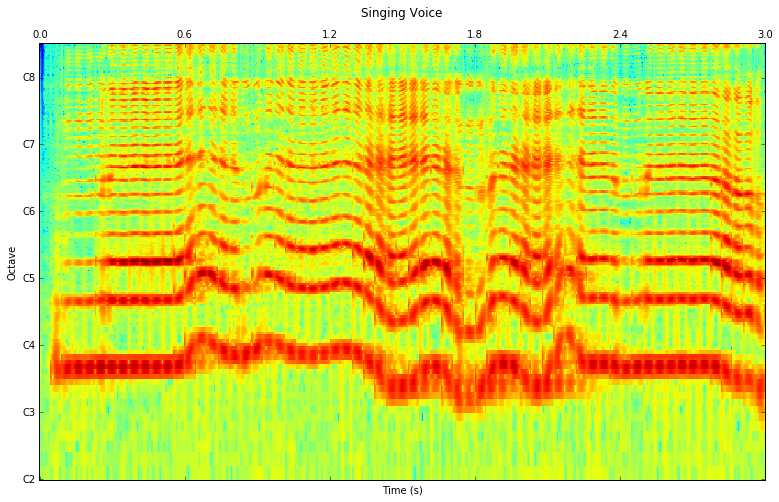

.. parsed-literal::

    Frame window: hamming
    Frame size: 8192

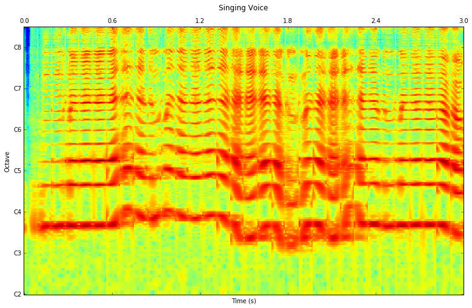

.. parsed-literal::

    Frame window: hamming
    Frame size: 16384

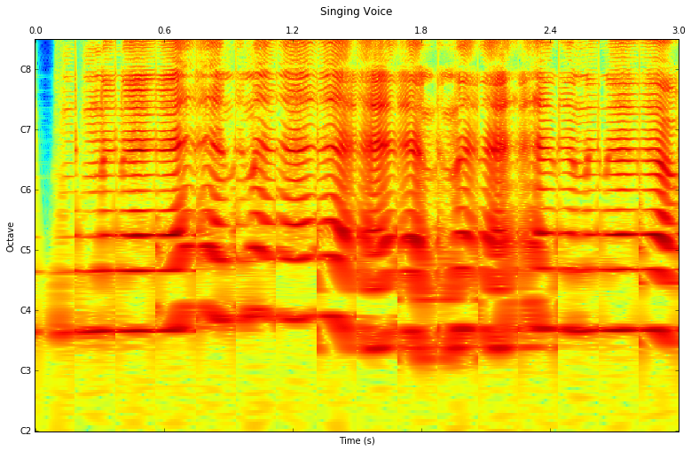

.. parsed-literal::

    Frame window: hamming
    Frame size: 32768

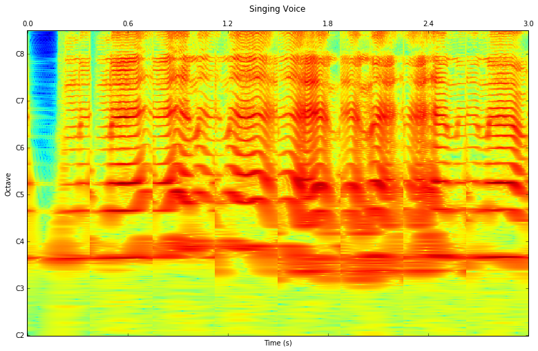

.. parsed-literal::

    Frame window: hann
    Frame size: 2048

.. parsed-literal::

    Frame window: hann
    Frame size: 4096

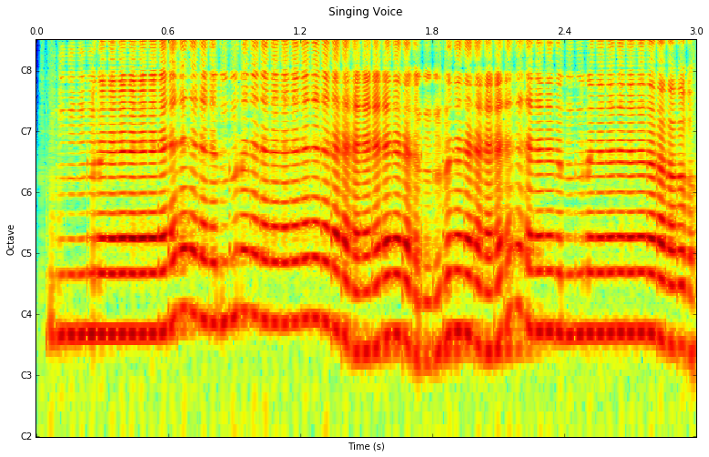

.. parsed-literal::

    Frame window: hann
    Frame size: 8192

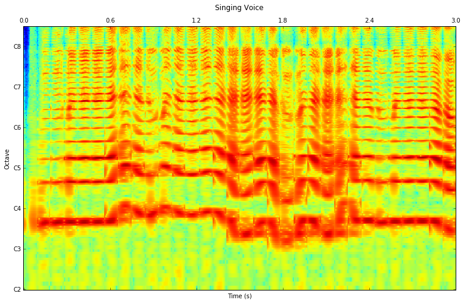

.. parsed-literal::

    Frame window: hann
    Frame size: 16384

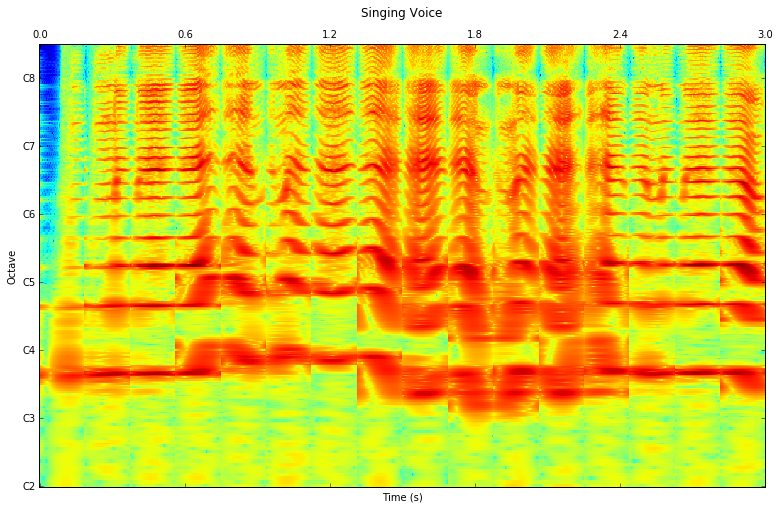

.. parsed-literal::

    Frame window: hann
    Frame size: 32768

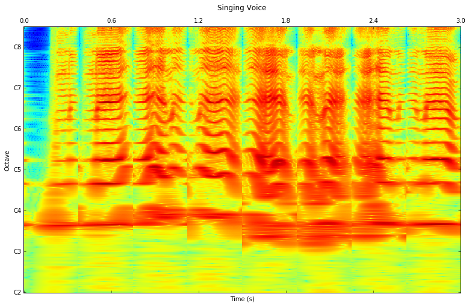

.. parsed-literal::

    Frame window: blackmanharris62
    Frame size: 2048

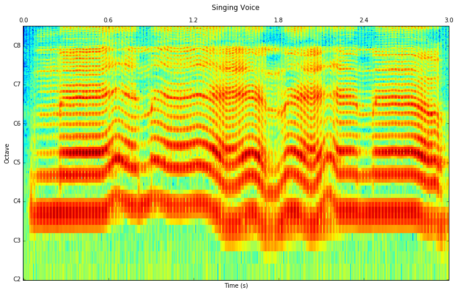

.. parsed-literal::

    Frame window: blackmanharris62
    Frame size: 4096

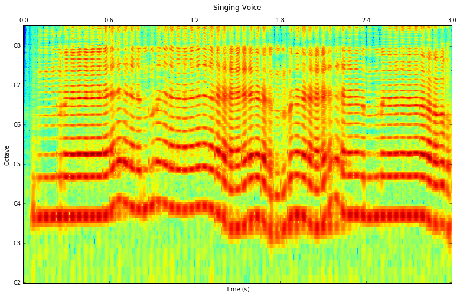

.. parsed-literal::

    Frame window: blackmanharris62
    Frame size: 8192

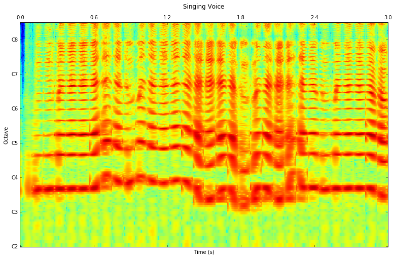

.. parsed-literal::

    Frame window: blackmanharris62
    Frame size: 16384

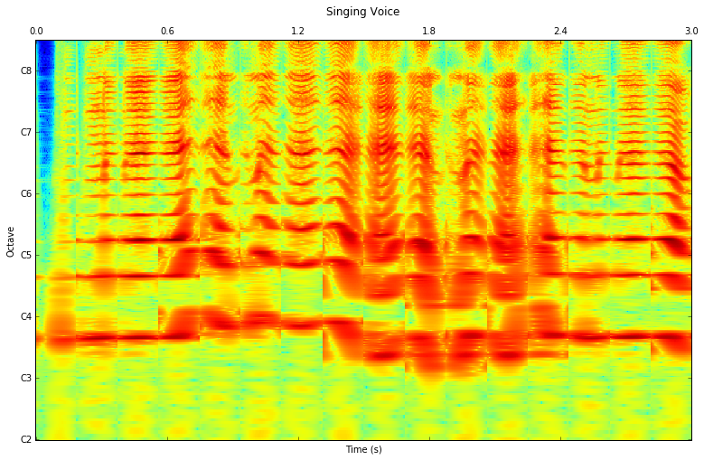

.. parsed-literal::

    Frame window: blackmanharris62
    Frame size: 32768

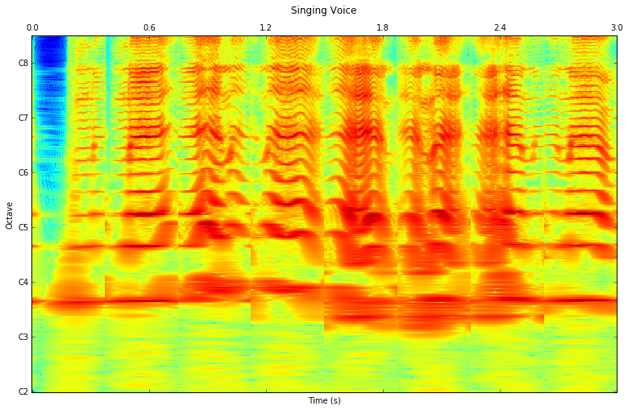

