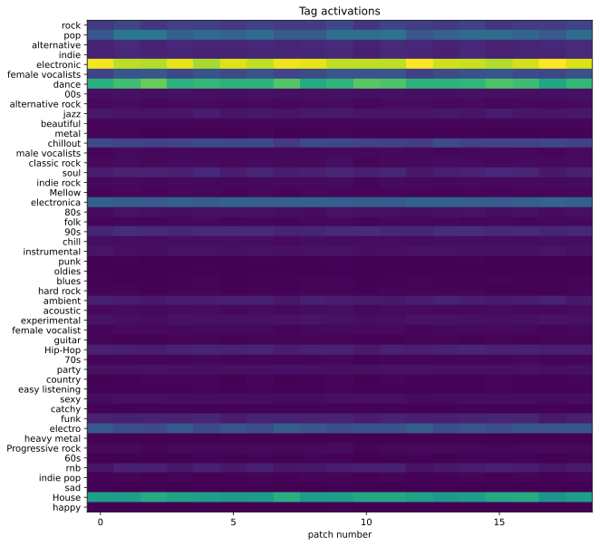
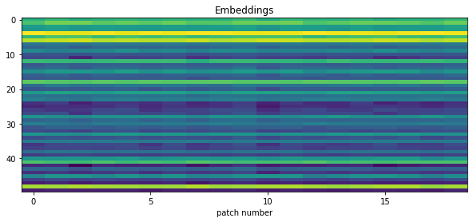

Music auto-tagging, classification, and embedding extraction
============================================================

In this tutorial, we use Essentia’s TensorFlow integration to perform
auto-tagging, classification, and embedding extraction.

Setup
-----

First of all, notice that the default Essentia’s ``pip`` package does
not include TensorFlow support. Currently, this is only available
through ``pip`` for Linux with Python ``>=3.5`` and ``<=3.7``.

.. code:: ipython3

    !pip install -q essentia-tensorflow

Alternatively, you can follow the instructions in this `blog
post <https://mtg.github.io/essentia-labs/news/tensorflow/2019/10/19/tensorflow-models-in-essentia/>`__
to build Essentia with TensorFlow support. This approach also works in
Mac, for Python ``>=3.8`` or with TensorFlow ``>=2.0``.

After this step, we can import the required packages.

.. code:: ipython3

    import json
    
    from essentia.standard import MonoLoader, TensorflowPredictMusiCNN, TensorflowPredictVGGish
    import numpy as np
    import matplotlib.pyplot as plt

The `Essentia models <https://essentia.upf.edu/models.html>`__\ ’ site
contains models for diverse purposes. Each model comes with a ``.json``
metadata file with information such as the classes it can predict, the
metrics achieved on training, or the model’s version.

Let’s download the ``MusiCNN`` auto-tagging model trained on the Million
Song Dataset.

.. code:: ipython3

    !wget -q https://essentia.upf.edu/models/autotagging/msd/msd-musicnn-1.pb
    !wget -q https://essentia.upf.edu/models/autotagging/msd/msd-musicnn-1.json

We can open the metadata file and check all the available keys.

.. code:: ipython3

    with open('msd-musicnn-1.json', 'r') as json_file:
        metadata = json.load(json_file)
    
    print(metadata.keys())

.. parsed-literal::

    dict_keys(['name', 'type', 'link', 'version', 'description', 'author', 'email', 'release_date', 'framework', 'framework_version', 'classes', 'model_types', 'dataset', 'schema', 'citation'])

Finally, we load an audio file to use as an example.

.. code:: ipython3

    audio_file = '../../../test/audio/recorded/techno_loop.wav'
    audio = MonoLoader(sampleRate=16000, filename=audio_file)()

Auto-tagging
------------

Now we have all the ingredients to perform auto-tagging with
``MusiCNN``. ``TensorflowPredictMusiCNN`` is our dedicated algorithm to
make predictions with models expecting ``MusiCNN``\ ’s mel-spectrogram
signature. We have to configure the ``graphFilename`` parameter with the
path to the model and feed the algorithm with audio sampled at 16kHz.
The output is a two-dimensional matrix ``[time, activations]``.

.. code:: ipython3

    activations = TensorflowPredictMusiCNN(graphFilename='msd-musicnn-1.pb')(audio)

Finally, we use ``matplotlib`` to plot the activations.

.. code:: ipython3

    ig, ax = plt.subplots(1, 1, figsize=(10, 10))
    ax.matshow(activations.T, aspect='auto')
    
    ax.set_yticks(range(len(metadata['classes'])))
    ax.set_yticklabels(metadata['classes'])
    ax.set_xlabel('patch number')
    ax.xaxis.set_ticks_position('bottom')
    plt.title('Tag activations')
    plt.show()

Classification with the transfer learning classifiers
-----------------------------------------------------

Essentia is shipped with a collection of single-label classifiers based
on transfer learning that rely on our auto-tagging models or other deep
embedding extractors. You can read our `blog
post <https://mtg.github.io/essentia-labs/news/tensorflow/2020/01/16/tensorflow-models-released/>`__
for a complete list of the available classifiers.

In this example, we use the ``danceability`` classifier based on the
``VGGish`` model.

.. code:: ipython3

    !wget -q https://essentia.upf.edu/models/classifiers/danceability/danceability-vggish-audioset-1.pb
    !wget -q https://essentia.upf.edu/models/classifiers/danceability/danceability-vggish-audioset-1.json

We use the ``TensorflowPredictVGGish`` algorithm because it generates
the required mel-spectrogram signature for this case, but if we wanted
to use the ``danceability`` classifier based on ``MusiCNN`` we should
use ``TensorflowPredictMusiCNN`` again.

.. code:: ipython3

    with open('danceability-vggish-audioset-1.json', 'r') as json_file:
        metadata = json.load(json_file)
    
    activations = TensorflowPredictVGGish(graphFilename='danceability-vggish-audioset-1.pb')(audio)

Finally, we can compute the global accuracy as the mean of the
activations along the temporal axis.

.. code:: ipython3

    for label, probability in zip(metadata['classes'], activations.mean(axis=0)):
        print(f'{label}: {100 * probability:.1f}%')

.. parsed-literal::

    danceable: 99.8%
    not_danceable: 0.2%

Embedding extraction
--------------------

A usual transfer learning approach consists of extracting
low-dimensional feature maps from one of the last layers of a
pre-trained model as embeddings for a new downstream task. The metadata
includes a field ``schema`` with the names of the most relevent layers
of each model, including layers that are suitable for embedding
extraction.

.. code:: ipython3

    with open('msd-musicnn-1.json', 'r') as json_file:
        metadata = json.load(json_file)
    
    print(metadata['schema'])

.. parsed-literal::

    {'inputs': [{'name': 'model/Placeholder', 'type': 'float', 'shape': [187, 96]}], 'outputs': [{'name': 'model/Sigmoid', 'type': 'float', 'shape': [1, 50], 'op': 'Sigmoid'}, {'name': 'model/dense_1/BiasAdd', 'type': 'float', 'shape': [1, 50], 'op': 'fully connected', 'description': 'logits'}, {'name': 'model/dense/BiasAdd', 'type': 'float', 'shape': [1, 200], 'op': 'fully connected', 'description': 'embeddings'}]}

From this, we see that ``model/dense_1/BiasAdd`` is the recommended
layer for embeddings. Additionally, an external tool such as
`Netron <https://netron.app/>`__ can be used to inspect the model and
get the information about the whole architecture.

``TensorflowPredictMusiCNN`` offers an ``output`` parameter that can be
configured to select the layer of the model to retrieve.

.. code:: ipython3

    embeddings = TensorflowPredictMusiCNN(graphFilename='msd-musicnn-1.pb', output='model/dense_1/BiasAdd')(audio)

.. code:: ipython3

    ig, ax = plt.subplots(1, 1, figsize=(10, 4))
    ax.matshow(embeddings.T, aspect='auto')
    ax.xaxis.set_ticks_position('bottom')
    ax.set_xlabel('patch number')
    plt.title('Embeddings')
    plt.show()

