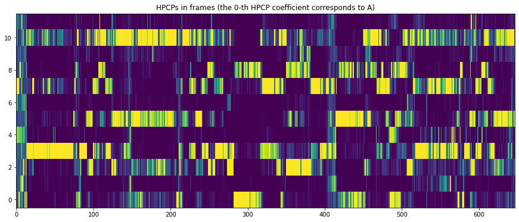

Tonality analysis: chords estimation
====================================

Essentia provides two basic algorithms for chord estimation given a
harmonic representation of input audio in a form of an *HPCPgram* (HPCP
chromagram; see the `HPCP tutorial <tutorial_tonal_hpcpkeyscale.html>`__
for how to compute it):

-  `ChordsDetection <https://essentia.upf.edu/documentation/reference/std_ChordsDetection.html>`__
   is a naive algorithm estimating chords in a sliding window over an
   input HPCP chromagram.
-  `ChordsDetectionBeats <https://essentia.upf.edu/documentation/reference/std_ChordsDetectionBeats.html>`__
   is a similar algorithm, but it estimates chords on segments between
   consecutive beats given their time positions as an additional input.

In addition,
`ChordsDescriptors <https://essentia.upf.edu/documentation/reference/std_ChordsDescriptors.html>`__
describes the estimated chord progression by means of key, scale,
histogram, and rate of change.

The analysis pipeline to compute HPCPs in this example is identical to
the one used the HPCP tutorial to compute a 12-bin HPCPgram:

.. code:: ipython3

    import essentia.streaming as ess
    import essentia
    
    audio_file = '../../../test/audio/recorded/mozart_c_major_30sec.wav'
    
    # Initialize algorithms we will use.
    loader = ess.MonoLoader(filename=audio_file)
    framecutter = ess.FrameCutter(frameSize=4096, hopSize=2048, silentFrames='noise')
    windowing = ess.Windowing(type='blackmanharris62')
    spectrum = ess.Spectrum()
    spectralpeaks = ess.SpectralPeaks(orderBy='magnitude',
                                      magnitudeThreshold=0.00001,
                                      minFrequency=20,
                                      maxFrequency=3500, 
                                      maxPeaks=60)
    
    # Use default HPCP parameters for plots.
    # However we will need higher resolution and custom parameters for better Key estimation.
    
    hpcp = ess.HPCP()
    
    # Use pool to store data.
    pool = essentia.Pool() 
    
    # Connect streaming algorithms.
    loader.audio >> framecutter.signal
    framecutter.frame >> windowing.frame >> spectrum.frame
    spectrum.spectrum >> spectralpeaks.spectrum
    spectralpeaks.magnitudes >> hpcp.magnitudes
    spectralpeaks.frequencies >> hpcp.frequencies
    hpcp.hpcp >> (pool, 'tonal.hpcp')
    
    # Run streaming network.
    essentia.run(loader)

Let’s plot the resulting HPCP:

.. code:: ipython3

    # Plots configuration.
    import matplotlib.pyplot as plt
    from pylab import plot, show, figure, imshow
    plt.rcParams['figure.figsize'] = (15, 6)
    
    # Plot HPCP.
    imshow(pool['tonal.hpcp'].T, aspect='auto', origin='lower', interpolation='none')
    plt.title("HPCPs in frames (the 0-th HPCP coefficient corresponds to A)")
    show()

Now we can run a naive estimation of chords with 2-second sliding window
over the computed HPCPgram:

.. code:: ipython3

    from essentia.standard import ChordsDetection
    
    # Using a 2 seconds window over HPCP matrix to estimate chords
    chords, strength = ChordsDetection(hopSize=2048, windowSize=2)(pool['tonal.hpcp'])
    print(chords)

.. parsed-literal::

    ['C', 'C', 'C', 'C', 'C', 'C', 'C', 'C', 'C', 'C', 'C', 'C', 'C', 'C', 'C', 'C', 'C', 'C', 'C', 'C', 'C', 'C', 'C', 'C', 'C', 'C', 'C', 'C', 'C', 'C', 'C', 'C', 'C', 'C', 'C', 'C', 'C', 'C', 'C', 'C', 'C', 'C', 'C', 'C', 'C', 'C', 'C', 'C', 'C', 'C', 'C', 'C', 'C', 'C', 'C', 'C', 'C', 'C', 'C', 'C', 'C', 'C', 'C', 'C', 'C', 'C', 'C', 'C', 'C', 'C', 'C', 'C', 'C', 'C', 'C', 'C', 'C', 'C', 'C', 'C', 'C', 'C', 'C', 'C', 'C', 'C', 'C', 'C', 'C', 'C', 'C', 'C', 'C', 'C', 'C', 'C', 'C', 'C', 'C', 'C', 'C', 'C', 'C', 'C', 'C', 'C', 'C', 'C', 'C', 'C', 'G', 'G', 'G', 'G', 'G', 'G', 'G', 'G', 'G', 'G', 'C', 'C', 'C', 'G', 'G', 'G', 'G', 'G', 'G', 'G', 'G', 'G', 'G', 'G', 'G', 'G', 'G', 'G', 'G', 'G', 'G', 'G', 'G', 'G', 'G', 'G', 'G', 'G', 'G', 'G', 'G', 'G', 'G', 'G', 'G', 'G', 'G', 'G', 'G', 'G', 'G', 'G', 'G', 'G', 'G', 'G', 'G', 'G', 'G', 'G', 'G', 'G', 'G', 'G', 'G', 'G', 'G', 'G', 'G', 'G', 'G', 'G', 'G', 'G', 'G', 'G', 'G', 'G', 'G', 'G', 'G', 'G', 'G', 'G', 'G', 'G', 'G', 'G', 'G', 'G', 'G', 'G', 'G', 'G', 'G', 'G', 'G', 'G', 'G', 'G', 'G', 'G', 'G', 'G', 'G', 'G', 'G', 'G', 'G', 'G', 'G', 'G', 'G', 'G', 'C', 'C', 'C', 'C', 'C', 'C', 'C', 'C', 'C', 'C', 'C', 'C', 'C', 'G', 'C', 'C', 'C', 'C', 'C', 'C', 'C', 'C', 'C', 'C', 'C', 'C', 'C', 'C', 'C', 'C', 'C', 'C', 'C', 'C', 'C', 'C', 'C', 'C', 'C', 'C', 'C', 'C', 'C', 'C', 'C', 'C', 'C', 'F', 'F', 'F', 'F', 'F', 'F', 'F', 'F', 'F', 'F', 'F', 'F', 'F', 'F', 'F', 'F', 'F', 'F', 'F', 'F', 'F', 'F', 'F', 'F', 'F', 'F', 'F', 'F', 'F', 'F', 'F', 'F', 'F', 'F', 'F', 'F', 'F', 'F', 'F', 'F', 'F', 'F', 'F', 'F', 'F', 'F', 'Am', 'Am', 'Am', 'Am', 'Am', 'Am', 'Am', 'Am', 'Am', 'Am', 'Am', 'C', 'C', 'C', 'C', 'C', 'C', 'C', 'C', 'C', 'C', 'C', 'C', 'C', 'C', 'Em', 'Em', 'Em', 'Em', 'Em', 'Em', 'Em', 'Em', 'Em', 'Em', 'Em', 'Em', 'Em', 'Em', 'Em', 'Em', 'Em', 'G', 'G', 'G', 'G', 'G', 'G', 'G', 'G', 'G', 'G', 'G', 'Em', 'Em', 'Em', 'Em', 'Em', 'Em', 'Em', 'Em', 'Em', 'Em', 'Em', 'Em', 'Em', 'Em', 'Em', 'Em', 'Em', 'Em', 'Em', 'C', 'C', 'C', 'C', 'C', 'C', 'C', 'C', 'C', 'C', 'C', 'C', 'C', 'C', 'C', 'Am', 'Am', 'Am', 'Am', 'Am', 'Am', 'Am', 'Am', 'Am', 'Dm', 'Dm', 'Dm', 'Dm', 'Dm', 'Dm', 'Dm', 'Dm', 'Dm', 'Dm', 'Dm', 'Dm', 'Dm', 'Dm', 'Dm', 'Dm', 'Dm', 'Dm', 'Dm', 'Dm', 'Dm', 'Dm', 'Dm', 'Dm', 'Dm', 'Dm', 'Dm', 'Dm', 'Dm', 'Dm', 'Dm', 'Dm', 'Dm', 'Dm', 'Dm', 'Dm', 'Dm', 'Dm', 'Dm', 'Dm', 'Dm', 'Dm', 'Dm', 'Dm', 'Dm', 'Dm', 'G', 'G', 'G', 'G', 'G', 'G', 'G', 'C', 'C', 'C', 'C', 'C', 'C', 'C', 'C', 'C', 'C', 'C', 'Dm', 'Dm', 'Dm', 'Dm', 'Dm', 'Dm', 'Dm', 'Dm', 'Dm', 'Dm', 'Dm', 'Dm', 'Dm', 'Dm', 'Dm', 'Dm', 'Dm', 'Dm', 'Dm', 'Dm', 'Dm', 'Dm', 'Dm', 'Dm', 'Dm', 'Dm', 'Dm', 'Dm', 'Dm', 'F', 'F', 'F', 'F', 'C', 'C', 'C', 'C', 'C', 'C', 'C', 'C', 'C', 'C', 'C', 'C', 'C', 'C', 'C', 'C', 'C', 'C', 'C', 'C', 'C', 'C', 'C', 'C', 'C', 'C', 'C', 'C', 'C', 'C', 'C', 'C', 'C', 'C', 'C', 'C', 'C', 'C', 'C', 'C', 'C', 'C', 'C', 'C', 'C', 'C', 'C', 'C', 'C', 'C', 'C', 'C', 'C', 'C', 'C', 'C', 'C', 'C', 'C', 'C', 'C', 'C', 'C', 'C', 'C', 'C', 'C', 'C', 'C', 'C', 'C', 'C', 'C', 'C', 'C', 'C', 'C', 'C', 'C', 'C', 'C', 'C', 'C', 'C', 'C', 'C', 'C', 'C', 'C', 'C', 'C', 'C', 'C', 'C', 'C', 'C', 'G', 'G', 'G', 'G', 'G', 'G', 'G', 'G', 'G', 'G', 'G', 'G', 'G', 'G', 'G', 'G', 'G', 'G', 'G', 'G', 'G', 'G', 'G', 'G', 'G', 'G', 'G', 'G', 'G', 'G', 'G', 'G', 'G', 'G', 'G', 'G', 'G', 'G', 'G', 'G', 'G']

The estimated chord sequence can be further post-processed.

TODO ChordsDescriptors

